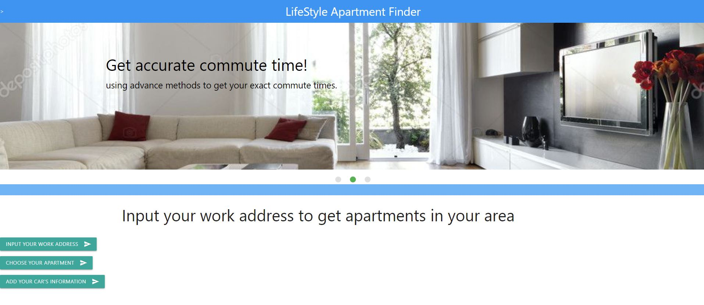

# team-project-1-LifeStyle-Apartment-finder
## Overview
### Elevator pitch
“Getting hired is hard enough! Leave the stress of finding your new home to LifeStyle Apartment Finder.”    
“Choose from a relevant list of apartments close to work, see real-time commute info, and calculate fuel costs.”    
For this project we created a website that accepts a users work address and search radius (in miles) from the users work address, returns a numbered list of relevant listings within the specified search radius, allows user to choose an apartment from the numbered list of returned apartments, allows user to input their vehicle gas mileage and current gas price ($/gallon), returns real-time commute time (work to chosen Apartment), driving route distance, and estimated monthly fuel cost. We wanted to create a web application for working professionals that takes the stress out of the search for a new home (especially if the move is to a new city).    
### Techinoloies used
JavaScript, jQuery, CSS, CSS framework (Materialize), HTML, Web APIs (DOM), Fetch API  
#### API(s) utilized
Trueway Matrix API  
Trueway Geocoding API  
Reality in US API  

## Future Development
We have a lot of inspiration to build off of Allen’s great idea for this app...
### Some UI enhancements can be added (examples):
When listings populate, user scroll/ selects button for listing, page navigates back to the top, and populates chosen listing with relevant information  
Outputted information for commute times, distances, and fuel cost can be formatted in a more user friendly way  
Persisted data can be accessed and used in a more user friendly manner  
Listing output is a bit “spartan”, can be styled more elegantly  
Listing image quality can be enhanced for listings who’s poster has lower resolution images (use SVG format here?)  
### Potential Feature enhancements:
Map Tile that displays real-time commute from work to chosen apartment  
Increase app-usability value by introducing available budget features (include user’s other bills), and calculate over/under for personal monthly finances  
Add in security to application  
Allow user to specify apartment parameters: number of beds/baths, square footage, price, etc.    

## Challenges
Navigating the asynchronous nature of JavaScript when calling APIs (i.e. fetch statements,.then, asynch/await statements, etc.)  
Integration of API code with Website logic code  
Learning Modals/New CSS framework/choosing CSS framework for project  
Git/GitHub  issues when working together collaboratively instead of individually    

## Credits
Jacob Frazer\(Github:[coderjake91](github.com/coderjake91)\)-Javascript(framework-logic)  
Allen Harborth\(Github:[allenharborth9835](github.com/allenharborth9835)\)-Javascript(API-logic)  
Langdon Echols\(Github:[LangdonEcho](github.com/LangdonEcho)\)-HTML/CSS  
William Stotts\(Github:[Dankkilla13](github.com/Dankkilla13)\)-HTML/CSS  

## screenshot

## documentation
[GitHub Repo](https://github.com/allenharborth9835/team-project-1)
[Live Page on Github](https://allenharborth9835.github.io/team-project-1/)
